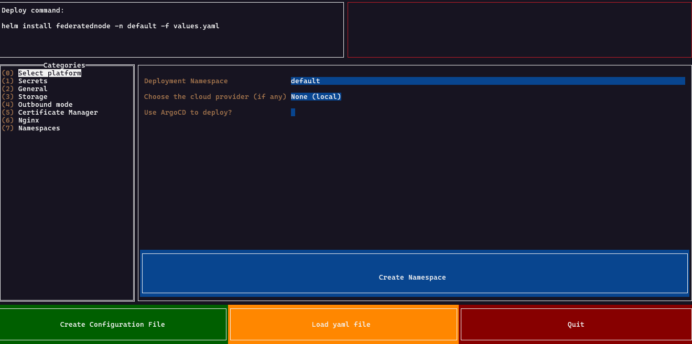

# Federated Node Configuration Helper

This lightweight tool will help in setting the Helm Chart values file, required secrets, and all needs to deploy the [Federated Node](https://github.com/Aridhia-Open-Source/PHEMS_federated_node).



## How to run
We do provide executables for both Debian and Windows systems, for now. Simply download them from the [Release section](https://github.com/Aridhia-Open-Source/Federated-Node-Config-Helper/releases).

Alternatively, you can [install Go](https://go.dev/doc/install) and run
```sh
go install github.com/Aridhia-Open-Source/Federated-Node-Config-Helper
```
